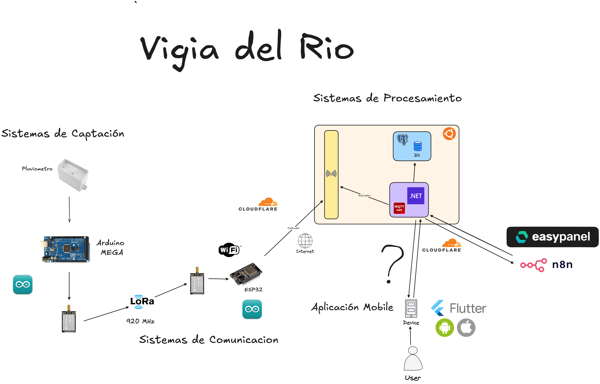

<p align="center">
    
</p>

# Sistema de Monitoreo y Alerta Temprana a Inundaciones

## Descripción del Proyecto

Este proyecto implementa una solución tecnológica basada en el Internet de las Cosas (IoT) para la ciudad de Villavicencio. Su propósito principal es mitigar los riesgos asociados a las inundaciones recurrentes causadas por el desbordamiento de los ríos Guatiquía, Ocoa y Guayuriba.

El sistema monitorea variables ambientales (precipitaciones) en tiempo real en zonas estratégicas y, mediante una arquitectura de comunicación de largo alcance, emite alertas tempranas a las comunidades vulnerables a través de **mensajería instantánea (Telegram/WhatsApp)** gestionada por flujos de automatización, permitiendo una reacción oportuna ante crecientes súbitas.

## Problemática y Justificación

La ubicación geográfica de Villavicencio la hace susceptible a desastres naturales, situación agravada por la expansión urbana y el cambio climático. Actualmente, la falta de sistemas localizados que traduzcan la lluvia en las montañas en alertas específicas deja a la población desprotegida. Este proyecto busca llenar ese vacío tecnológico proporcionando datos en tiempo real para la toma de decisiones coordinadas sin requerir que los usuarios instalen aplicaciones adicionales.

## Objetivos

### Objetivo General

Desarrollar un sistema de alerta temprana basado en IoT que monitoree la actividad y precipitaciones en zonas estratégicas cercanas a Villavicencio, notificando a los habitantes en zonas de alto riesgo mediante **Webhooks y n8n a través de Telegram o WhatsApp** para minimizar daños.

### Objetivos Específicos

- **Diseñar:** Estaciones de monitoreo con microcontroladores (Arduino Mega) y sistemas de comunicación LoRa.
- **Establecer:** Una plataforma central que reciba, procese y analice los datos.
- **Configurar:** Flujos de trabajo en n8n que integren Webhooks y APIs de mensajería para notificar automáticamente a los usuarios según los parámetros de riesgo.

## Marco Tecnológico y Arquitectura

El sistema utiliza una arquitectura modular y herramientas de código abierto:



### Hardware

- **Arduino Mega:** Responsable de la lectura de sensores debido a su alta capacidad de E/S.
- **Módulo LoRa:** Tecnología de modulación de espectro ensanchado (Chirp Spread Spectrum) para transmisión de datos a larga distancia con bajo consumo energético.
- **ESP32:** Actúa como Gateway, recibiendo paquetes LoRa y reenviándolos a internet vía Wi-Fi.

### Software

- **.NET:** Framework utilizado para el desarrollo del backend y procesamiento de datos.
- **n8n:** Plataforma de automatización de flujos de trabajo para orquestar la lógica de las alertas.
- **Webhooks & APIs de Mensajería:** Integración directa con Telegram/WhatsApp para la entrega de notificaciones.
- **FastAPI:** Componente para la gestión de la API del servidor (ver diagrama de arquitectura).
- **Metodología:** Scrum.

## Requerimientos del Sistema

### Funcionales

- **(RF-001)** Lectura precisa de datos de lluvia por el nodo sensor.
- **(RF-002)** Transmisión de paquetes de datos mediante protocolo LoRa.
- **(RF-003)** Reenvío de datos del Gateway al backend a través de Internet.
- **(RF-004)** Recepción de datos mediante Webhook y validación de formato en la plataforma n8n.
- **(RF-005)** Gestión de suscriptores (Chat IDs) y envío de notificaciones automáticas.

### No Funcionales

- **(RNF-001)** Latencia total (desde el sensor hasta la recepción del mensaje) no superior a 60 segundos.
- **(RNF-002)** Cumplimiento con la Ley Estatutaria 1581 de 2012 (Protección de datos personales) y Resolución 105 de 2020 de la ANE (Espectro).
- **(RNF-003)** Disponibilidad del backend y servicios de automatización del 99.5%.

## Autores

- **Erick Andrés Baez Cruz**
- **Sebastián Felipe Buitrago Ayala**
- Universidad Cooperativa de Colombia - Electiva 4
- Ingeniero Pedro Osorio

---

# Vigia del Rio Procesamiento

Módulo que se suscribe a un servidor MQTT para recibir datos, procesarlos y almacenarlos, permitiendo que la información esté disponible para su consumo a través de una API o disparadores hacia n8n.

## Iniciar Proyecto

### Opción 1: Docker (Recomendado)

Esta opción levanta tanto la aplicación como una base de datos PostgreSQL configurada automáticamente.

1. Asegúrate de tener Docker y Docker Compose instalados.
2. Ejecuta el siguiente comando en la raíz del proyecto:

```bash
docker-compose up --build -d
